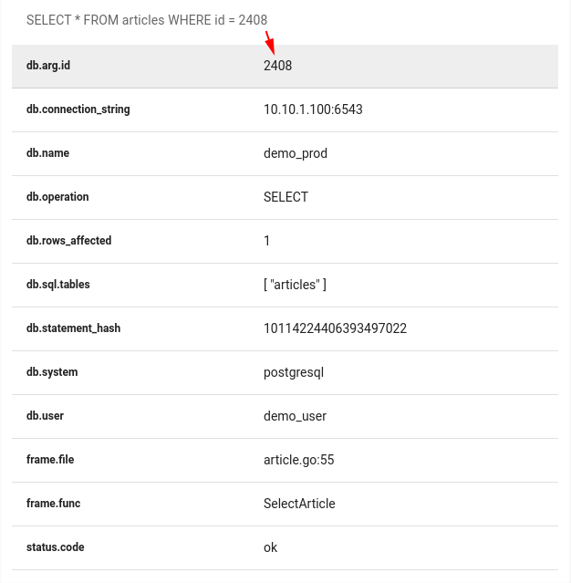

# Tracing

go-pg supports tracing out-of-the-box using [OpenTelemetry](https://opentelemetry.io/) API. To
enable queries instrumentation, use the following code:

```go
import (
    "github.com/go-pg/pg/v10"
    "github.com/go-pg/pg/v10/pgext"
)

db := pg.Connect(&pg.Options{...})

db.AddQueryHook(&pgext.OpenTelemetryHook{})
```

`OpenTelemetryHook` sends SELECT, UPDATE, and DELETE queries as is. But it strips data values for
INSERT queries since they can contain sensitive information.

This is how span looks at Uptrace.dev which is an OpenTelemetry backend that supports
[distributed traces and metrics](https://uptrace.dev/1/groups?system=db%3Apostgresql).


